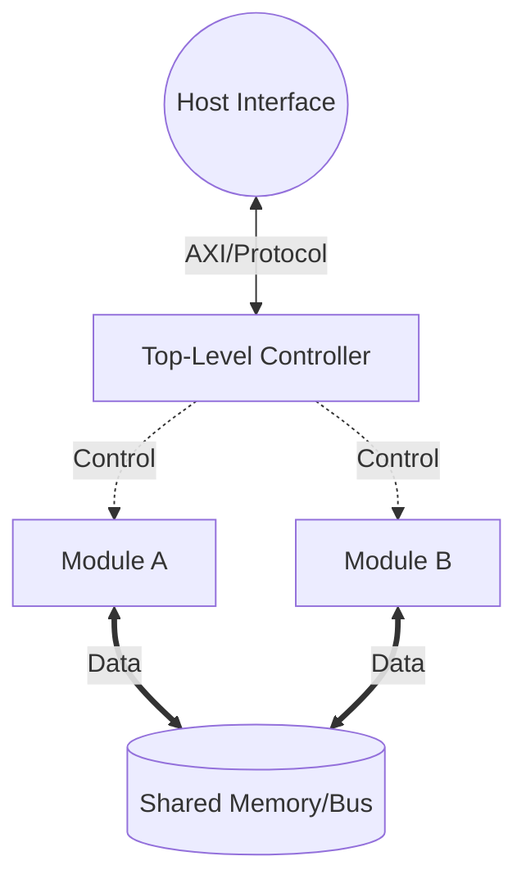

# System Architecture & Top-Level Integration

## 1. Top-Level Overview
*Provide a high-level summary (2-3 paragraphs) of the entire system architecture. Explain the core philosophy of the integration (e.g., memory-centric, stream-centric, bus-based) and how data generally flows from the host interface through the various datapaths and back out.*

## 2. Global Block Diagram
*Use Mermaid.js to define the top-level integration. Show the major functional units, the central memory/bus fabric, the host interface, and the high-level data/control pathways.*

## 3. Clocking & Resets
*Define the global clock domains and reset strategies to ensure the entire team is on the same page regarding synchronous vs. asynchronous logic.*

* **Main Clock (`clk_i`):** *[Define the target frequency and what this clock drives.]*
* **Secondary Clock (`clk2_i`):** *[Delete if N/A. Define any other clock domains, such as a slower bus clock or a high-speed DSP clock.]*
* **Global Reset (`rst_ni`):** *[Specify active-high vs. active-low, and whether the reset assertion/deassertion is synchronous or asynchronous.]*

## 4. Global Memory Map
*If the system shares a central memory fabric, define the high-level address spaces, regions, or polynomial slots here. This prevents different modules from accidentally overwriting each other's data.*

| Region Name | Address / ID Range | Size / Count | Purpose / Description |
| :--- | :--- | :--- | :--- |
| **[Region 1]** | `0x0000 - 0x0FFF` | [Size] | *[Description]* |
| **[Region 2]** | `0x1000 - 0x1FFF` | [Size] | *[Description]* |
| **[Region 3]** | `0x2000 - 0x2FFF` | [Size] | *[Description]* |

*Note: Document any specific read/write permissions or volatile/non-volatile semantics for these regions here.*

## 5. Subsystem Priority & Arbitration
*Define the rules of the road for the shared bus or memory. If multiple modules request access in the exact same clock cycle, who wins?*

1. **[Highest Priority Client]:** *[Reason they get priority (e.g., strict timing requirements, prevents pipeline stalls).]*
2. **[Medium Priority Client]:** *[Reasoning and expected bandwidth usage.]*
3. **[Lowest Priority Client]:** *[Reasoning. Usually reserved for background tasks, host polling, or asynchronous reads.]*

*Note: Describe the arbitration policy (e.g., Fixed Priority, Round-Robin) and what happens to the losing clients (e.g., they receive a `stall` signal, or `tready` is deasserted).*
