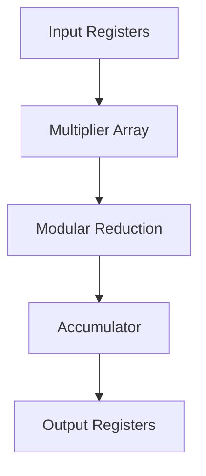

# [Module Name] Datapath & Microarchitecture

## 1. Overview
*Provide a 1-2 sentence summary of the physical datapath. What is the core arithmetic or logical operation happening here?*
**Example:** The PAU datapath consists of a deeply pipelined Cooley-Tukey butterfly unit featuring parallel 12x12-bit DSP multipliers and a custom Montgomery reduction stage.

## 2. Block Diagram
*Use Mermaid.js to create a high-level flowchart of the datapath from `s_axis_tdata` to `m_axis_tdata`. This helps AI agents understand the topology.*

## 3. Pipeline Stages
*Break down the datapath cycle-by-cycle. This is critical for timing closure and understanding latency.*

| Stage | Logic / Operation | Registers Used |
| :--- | :--- | :--- |
| **IF (Stage 0)** | Fetch coefficients from AXI-Stream. | `coef_a_q`, `coef_b_q` |
| **EX1 (Stage 1)** | 12x12-bit multiplication. | `mult_res_q` |
| **EX2 (Stage 2)** | Modular reduction ($q = 3329$). | `reduce_res_q` |
| **WB (Stage 3)** | Format and drive to memory/output. | `out_data_q` |

## 4. Critical Path Analysis
*Identify the longest combinational logic path in this module. This tells the synthesis tools (and future engineers) where $F_{max}$ bottlenecks will likely occur.*
* **Start Point:** [e.g., `mult_res_q` register]
* **End Point:** [e.g., `reduce_res_q` register]
* **Logic Traversed:** [e.g., 24-bit carry-lookahead adder and multiplexer tree.]

## 5. Hardware Constraints & Area Trade-offs
*Document any specific design decisions made to save Area, Power, or Timing.*
* [e.g., "We time-multiplexed the Keccak core to reuse the permutation logic for both SHA3 and SHAKE, saving roughly 40K Gate Equivalents at the cost of throughput."]
