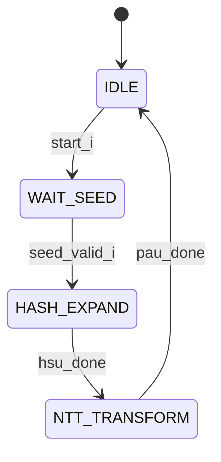

# [Module Name] FSM: [State Machine Name]

## 1. Overview
*Provide a 1-2 sentence summary of what this specific state machine controls.*
**Example:** The Main Orchestration FSM controls the high-level sequencing of the Key Generation phase, coordinating the Hash Sampler Unit (HSU) for seed expansion and the Polynomial Arithmetic Unit (PAU) for NTT transformations.

## 2. State Diagram
*Use Mermaid.js to define the state flow. This renders visually on GitHub and provides perfect topological context for AI agents.*

## 3. State Definitions
*Define what actually happens inside each state. Keep descriptions focused on datapath control and memory routing.*

| State Name | Encodings (Optional) | Description & Key Actions |
| :--- | :--- | :--- |
| `IDLE` | `3'b000` | Default reset state. Awaits the `start_i` trigger. Datapath is gated. |
| `WAIT_SEED` | `3'b001` | Asserts `m_axis_tready` to the seed FIFO and waits for `tvalid`. |
| `HASH_EXPAND` | `3'b010` | Triggers the Keccak core. Routes Keccak outputs to Poly-Mem Bank 0. |

## 4. Transition Conditions
*Explicitly map the exact signals required to jump between states. This helps during waveform debugging when an FSM gets "stuck."*

| Current State | Condition (Signal) | Next State | Notes |
| :--- | :--- | :--- | :--- |
| `IDLE` | `start_i == 1'b1` | `WAIT_SEED` | - |
| `WAIT_SEED` | `s_axis_tvalid == 1'b1` | `HASH_EXPAND` | Latches the seed into the internal register. |
| `HASH_EXPAND` | `hsu_done_i == 1'b1` | `NTT_TRANSFORM` | - |

## 5. Control Outputs (Moore/Mealy)
*List the critical control signals driven by this FSM. Specify if the output is Moore (depends only on state) or Mealy (depends on state + inputs).*

| Output Signal | Type | Active State(s) | Description |
| :--- | :--- | :--- | :--- |
| `hsu_start_o` | Moore | `HASH_EXPAND` | 1-cycle pulse to wake up the Hash Sampler Unit. |
| `mem_we_o` | Mealy | `NTT_TRANSFORM` | Asserted only when `pau_valid_i` is high during the NTT state. |

## 6. Latency & Stall Conditions
*Note any expected cycle counts or potential deadlocks.*

* **Expected Execution Time:** [e.g., 256 cycles for the `NTT_TRANSFORM` state, assuming no memory stalls.]
* **Stall Behavior:** [e.g., If `mem_stall_i` asserts during `HASH_EXPAND`, the FSM freezes the Keccak pipeline registers until the stall clears.]
