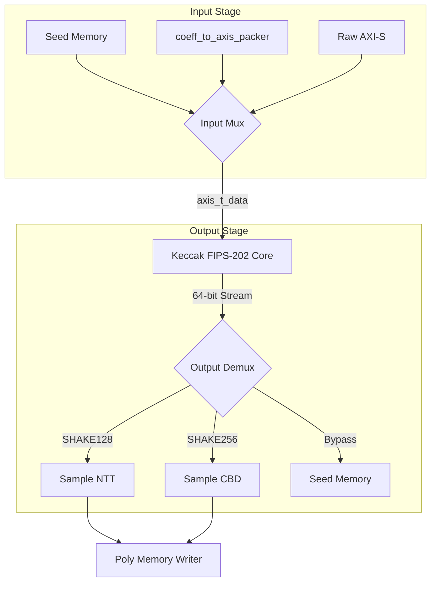

# Hash Sampler Unit (HSU) Datapath & Microarchitecture

## 1. Overview
The HSU datapath routes input data (seeds or packed polynomials) through an input multiplexer into a high-performance, 1-cycle-per-round Keccak core. The Keccak squeeze stream is then demultiplexed into specialized samplers (NTT Rejection or CBD) or routed directly to memory for bypass hashing.

## 2. Block Diagram

## 3. Pipeline Stages
| Stage | Logic / Operation | Key Submodules |
| :--- | :--- | :--- |
| **IF (Input Fetch)** | Fetch inputs. If `input_sel_i=1`, packer gearboxes 12-bit coeffs into 8-byte aligned blocks. | `coeff_to_axis_packer` |
| **PERM (Permutation)** | Keccak core absorbs input and squeezes 64-bit pseudo-random beats. | `keccak_core` |
| **SAMP (Sampling)** | Perform NTT Rejection (Alg 7) or CBD (Alg 8) on the Keccak stream. | `sample_ntt`, `sample_cbd` |
| **WB (Writeback)** | Zero-pad sampler outputs (48-bit to 64-bit) or route bypass hashes to RAM. | `hash_sampler_unit` (Routing) |

## 4. Critical Path Analysis
* **Start Point:** `keccak_core` state registers.
* **End Point:** `keccak_core` state registers / Sampler output registers.
* **Logic Traversed:** The 1-cycle Keccak permutation core represents the deepest logic path in the unit, requiring 24 rounds of $\chi, \theta, \rho, \pi, \iota$ transformations depending on synthesis optimizations.
* *Note:* Secondary bottleneck exists in the `sample_ntt` rejection loop checking if 12-bit chunks are $< q$ (3329).

## 5. Hardware Constraints & Area Trade-offs
* **Resource Sharing:** A single Keccak core is heavily time-multiplexed for all ML-KEM hash functions ($G, H, J, PRF$) to save massive area (~40K+ gates).
* **Gearbox Throttling:** `coeff_to_axis_packer` prevents read duplication via `rd_pending_q`, enforcing strict 8-byte FIPS-203 alignment. This trades 1 cycle of initial read latency for robust alignment without internal FIFOs.
* **Zero Padding:** Poly Sampler outputs are strictly 48-bit wide (four 12-bit coefficients). The top-level HSU routes them onto a standard 64-bit datapath by tying the upper 16 bits to zero, ensuring clean memory writes.
