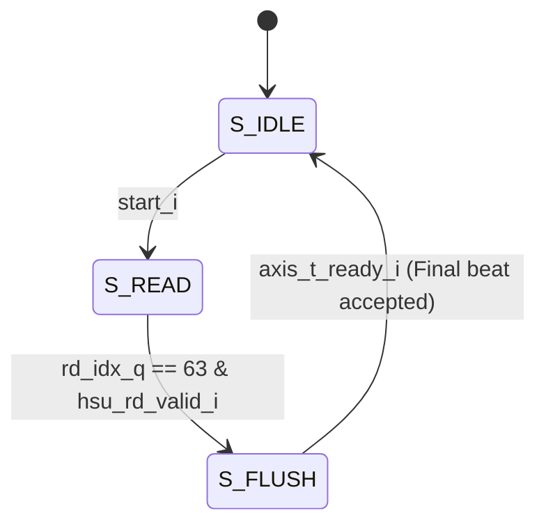

# Hash Sampler Unit: Packer FSM (`coeff_to_axis_packer`)

## 1. Overview
The top-level Hash Sampler Unit (HSU) routes data combinationally and tracks completion via a simple `done_r` sticky bit, avoiding a complex top-level FSM. However, the `coeff_to_axis_packer` submodule contains a critical state machine. This FSM orchestrates reading 12-bit polynomial coefficients from memory, packing them into 8-byte (64-bit) AXI-Stream beats, and handling end-of-polynomial flushes to satisfy FIPS-203 ByteEncode alignment requirements during multi-phase absorption.

## 2. State Diagram

## 3. State Definitions
| State Name | Encodings | Description & Key Actions |
| :--- | :--- | :--- |
| `S_IDLE` | `2'b00` | Default reset state. Clears gearbox buffer and `packer_done_o`. Awaits `start_i` trigger. |
| `S_READ` | `2'b01` | Main packing state. Fetches 4x 12-bit coefficients (48 bits) per memory read. Buffers them into a 128-bit gearbox. Whenever the gearbox holds $\ge$ 8 bytes, it asserts `axis_t_valid_o` to push 64 bits to Keccak. |
| `S_FLUSH` | `2'b10` | Triggered on the final polynomial index (63). Flushes any remaining bytes in the gearbox to Keccak. Calculates a partial `axis_t_keep_o` mask if the remaining byte count is not a multiple of 8. |

## 4. Transition Conditions
| Current State | Condition (Signal) | Next State | Notes |
| :--- | :--- | :--- | :--- |
| `S_IDLE` | `start_i == 1'b1` | `S_READ` | Initializes `rd_idx_q` to 0. |
| `S_READ` | `rd_idx_q == 63` && `hsu_rd_valid_i == 1'b1` | `S_FLUSH` | 63 is the final index for a 256-coeff polynomial read 4 at a time ($256/4 - 1$). |
| `S_FLUSH`| `axis_t_ready_i == 1'b1` (and buffer empty) | `S_IDLE` | Returns to IDLE and pulses `packer_done_o`. |

## 5. Control Outputs (Moore/Mealy)
| Output Signal | Type | Active State(s) | Description |
| :--- | :--- | :--- | :--- |
| `hsu_rd_req_o` | Moore | `S_READ` | Memory read request. Throttled by `rd_pending_q` to prevent duplicate reads while waiting for `hsu_rd_valid_i`. |
| `axis_t_valid_o` | Moore | `S_READ`, `S_FLUSH`| High when gearbox has $\ge$ 8 bytes, OR during `S_FLUSH` if any bytes remain. |
| `axis_t_keep_o` | Moore | `S_FLUSH` | Byte enable mask. `8'hFF` during `S_READ`. Calculated dynamically in `S_FLUSH` based on remaining `fill_count`. |
| `packer_done_o` | Moore | `S_IDLE` | High in IDLE state *after* an operation has completed. |

## 6. Latency & Stall Conditions
* **Throttled Reads:** Because the Poly Memory Reader is pipelined, the FSM uses a `rd_pending_q` flag. Once a read is requested, the FSM drops `hsu_rd_req_o` and waits for `hsu_rd_valid_i` before advancing indices. This prevents address duplication.
* **Gearbox Backpressure:** If the Keccak core stalls (`axis_t_ready_i == 0`), the gearbox will continue to accumulate incoming memory data up to 128 bits. If it approaches overflow ($>12$ bytes), it halts `hsu_rd_req_o` until Keccak consumes a beat.
