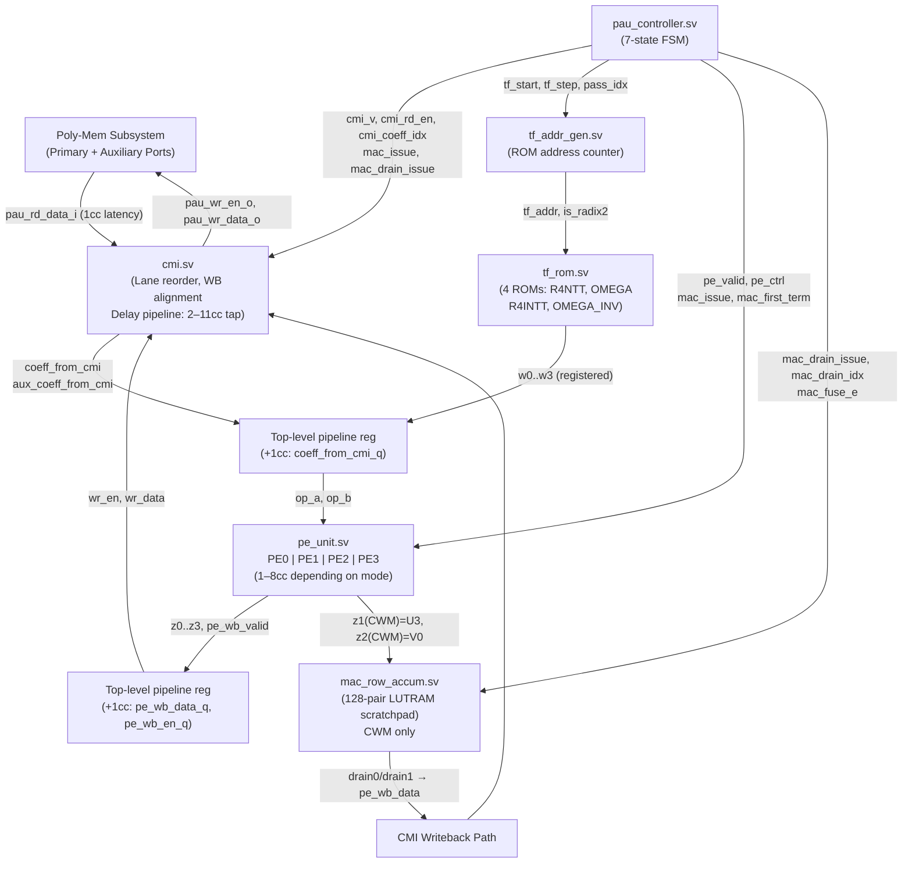

# Polynomial Arithmetic Unit — Datapath & Microarchitecture

## 1. Overview

The PAU datapath is a deeply pipelined, multi-mode butterfly array built from four Processing Elements (PE0–PE3), a LUT-based modular multiplier (3 clock cycles), registered modular adders and subtractors (1 clock cycle each), and a scratchpad-backed row accumulator for CWM. The Conflict-free Memory Interface (CMI) handles read-response lane reordering and writeback-address alignment. A twiddle factor ROM (4 ROMs, 381 bytes total) supplies pre-computed NTT/INTT/CWM constants.

## 2. Block Diagram

## 3. Modular Arithmetic Primitives

| Module | Latency | Operation | Notes |
| :--- | :--- | :--- | :--- |
| `mod_mul` | **3cc** | (A × B) mod 3329 | Stage 0: input reg. Stage 1: 24-bit multiply + radix-16 LUT reduction (bits 15:12 and 19:16). Stage 2: deferred LUT (bits 23:20) + 4-mux mini-reduction + output reg. |
| `mod_add` | **1cc** | (A + B) mod 3329 | 13-bit add, conditional subtract Q, registered output. `(* keep = "true" *)` prevents carry-chain merging. |
| `mod_sub` | **1cc** | (A − B) mod 3329 | 13-bit subtract, conditional add Q, registered output. `(* keep = "true" *)` prevents merging. |
| `mod_uni_add_sub` | **1cc** | (A ± B) mod 3329 | Parallel add and sub paths, `is_sub_i` mux at registered output. Used in PE1 cross-terms. |
| `mod_div_by_2` | **0cc** | A × 2⁻¹ mod 3329 | Combinational: odd input adds Q then right-shifts; even input right-shifts only. Used in PE0/PE1/PE3 INTT paths. |
| `mac_pair_add` | **0cc** | (acc + cwm) mod Q (×2 lanes) | Combinational two-lane adder. Used inside `mac_row_accum` accumulate path. |

## 4. Processing Element Topology

The four PEs are physically the same per-butterfly pipeline depth but are routed differently per mode. PE pipeline latency is **4 clock cycles** for NTT, INTT, and CWM; **3 clock cycles** for COMP/DECOMP; **1 clock cycle** for ADDSUB. This is achieved by feeding `valid_i` through gated `delay_n` shift registers of the appropriate depth inside each PE.

### 4.1 PE Cascade Topology per Mode

| Mode | Stage 1 (fresh inputs) | Stage 2 (cross-PE feedback) | pe_unit total latency |
| :--- | :--- | :--- | :--- |
| **NTT Radix-4** | PE0: (X0, X2, w2) → U0/V0 · PE2: (X1, X3, w1, w3) → U2/V2/M | PE1: (U0, U2) → U1/V1 · PE3: (V0, V2, w4) → U3/V3 | **8cc** |
| **NTT Radix-2** | PE0 ∥ PE2 in parallel, PE1/PE3 unused | — | **4cc** |
| **INTT Radix-4** | PE1: (X2, X3) → U1/V1 · PE3: (X0, X1, w4) → U3/V3 | PE0: (U3, U1, w2⁻¹) → U0/V0 · PE2: (V3, V1, w1⁻¹, w3⁻¹) → U2/V2 | **8cc** |
| **INTT Radix-2** | PE0 ∥ PE2 in parallel (÷2 via INV_2_MOD_Q=1665), PE1/PE3 unused | — | **4cc** |
| **CWM** | PE1: (g_2i, f_2i+1, f_2i, g_2i+1) → U1/V1 · PE2: (f_2i, g_2i+1, g_2i, f_2i+1) → U2/V2/M | PE0: (M, U1, V1) → U0/V0 · PE3: (U2, V2, omega) → U3/V3 | **8cc** (z1=U3+1cc delay, z2=V0) |
| **ADDSUB** | PE0 ∥ PE1 ∥ PE2 ∥ PE3 all parallel, op_b = Y operand | — | **1cc** |
| **COMP/DECOMP** | PE0 ∥ PE2 ∥ PE3, PE1 unused | — | **3cc** |

### 4.2 PE Internal Operand Notes

- **PE2** is the only PE with two multipliers. In CWM it computes `f_2i * g_2i` and `f_2i+1 * g_2i+1` in parallel and exposes their sum as the cross-term `M` output (used by PE0 in Stage 2).
- **PE1** has no multiplier. It handles Karatsuba cross-terms via `mod_add` and `mod_uni_add_sub`, padded to 4cc via a 3-stage delay chain.
- **PE3** injects the fixed Radix-4 root `OMEGA_4_NTT = 1729` (= ζ^64 mod Q) on every NTT/INTT pass. CWM drives this input to 0.
- In INTT, twiddle factors reaching PE0/PE2 are delayed 4 cycles (`op_b0_d4`, `op_b1_d4`, `op_b2_d4`) inside `pe_unit` to align with the cross-PE feedback path from Stage 1.
- In CWM, `op_b0` (omega) is delayed 3 cycles (`op_b0_d3`) to align with the Stage 2 PE3 inputs.

## 5. Pipeline Stages — End-to-End

The following describes the full path from memory read to memory write for a single NTT Radix-4 coefficient group (8cc PE path).

| Cycle | Stage | What Happens |
| :--- | :--- | :--- |
| 0 | CMI Read Issue | Controller asserts `cmi_rd_en_o`. CMI forwards `pau_rd_en_o` to memory. |
| 1 | Memory Response | Memory returns `pau_rd_valid_i`. CMI lane-reorders data into `coeff_from_cmi`. |
| 2 | Input Pipeline Reg | `coeff_from_cmi` registered into `coeff_from_cmi_q` (top-level +1cc pipe). |
| 3–6 | PE Stage 1 (4cc) | PE0 + PE2 compute butterfly Stage 1 outputs (U0/V0, U2/V2). |
| 7–10 | PE Stage 2 (4cc) | PE1 + PE3 consume Stage 1 outputs and produce final U1/V1, U3/V3. |
| 11 | Writeback Pipeline Reg | `pe_wb_data` registered into `pe_wb_data_q` (top-level +1cc pipe). |
| 12 | CMI Write | CMI taps the writeback delay pipeline at depth = `wb_latency_i` (11cc for NTT passes 0–2) and drives `pau_wr_en_o` / `pau_wr_data_o`. |

> [!NOTE]
> NTT Pass 3 (Radix-2) has `wb_latency = 7cc` because the 4cc PE path replaces the 8cc cascaded path. ADDSUB uses `wb_latency = 4cc` (1cc PE + 1cc top pipe + 2cc CMI). CWM drain uses `wb_latency = 4cc` (e_hat read → mac_row_accum fuse → top pipe → CMI write).

## 6. Twiddle Factor ROM

The `tf_rom` stores four pre-computed tables totalling **3048 bits (381 bytes)**.

| ROM | Depth | Width | Content |
| :--- | :--- | :--- | :--- |
| `R4NTT_ROM` | 21 entries | 36-bit | `{w1[11:0], w2[11:0], w3[11:0]}` — forward NTT Radix-4. Pass 1: entry [0]; Pass 2: [1..4]; Pass 3: [5..20]. Sequential t++ per block. |
| `OMEGA_ROM` | 64 entries | 12-bit | Forward Radix-2 omega for NTT Pass 4 (stage 7). Addressed by j/4. Also used by CWM (block index 0..63). |
| `R4INTT_ROM` | 21 entries | 36-bit | Pre-negated inverse constants. Stores `Q − ζ⁻¹` rather than `ζ⁻¹` so the PE subtractor produces `(B−A)·ζ⁻¹` directly, eliminating runtime negation. |
| `OMEGA_INV_ROM` | 64 entries | 12-bit | `(2·omega)⁻¹` for INTT Radix-2 Pass 1. Drives PE2's W1 to `INV_2_MOD_Q = 1665` for the implicit ÷2. |

**Port mapping to `pe_unit`**: `w0_o → op_b0 (PE0)`, `w1_o → op_b1 (PE2 W1)`, `w2_o → op_b2 (PE2 W2)`, `w3_o → op_b3 (PE3 omega_4)`.

All ROM outputs are registered (**1cc read latency**). The `tf_addr_gen` generates addresses combinationally; the ROM registration absorbs this combinational output before it reaches the PEs.

## 7. CWM Scratchpad Accumulator

`mac_row_accum` implements a 128-pair (256-coefficient) scratchpad to avoid re-reading and re-writing a partial accumulator polynomial through memory on every term.

**Accumulate phase** (for each of the k source terms):
1. The controller sweeps `pair_idx` 0..127, issuing one CWM beat per pair.
2. On the first term (`first_term_i` pulse), the scratchpad is seeded with the raw PE output (overwrite, not add). An internal `init_active_q` flag keeps seeding until `pair_idx == 127`.
3. On subsequent terms, `mac_pair_add` computes `(acc_old + cwm_new) mod Q` and writes the result back to the same slot.
4. A **write-through bypass** (`last_wr_valid_q`, `last_wr_pair_idx_q`) guarantees deterministic reads on back-to-back accesses to the same pair index, independent of LUTRAM read-during-write behavior.

**Drain phase** (after all k terms):
1. The controller sweeps `drain_idx` 0..127. For each pair it asserts `drain_req_i` together with the live `e_hat` coefficients (`e0_i`, `e1_i`) from the primary CMI response.
2. If `fuse_e_i` is high, `mod_add` combines `acc_scratch + e_hat` for both lanes. The result is held in a 1-entry output register (`drain_valid_o` / `drain0_o` / `drain1_o`).
3. The drain register is consumed when `drain_ready_i` (= `cmi_ready`) is asserted. The CMI then writes the pair to the t_hat slot in memory.

## 8. Top-Level Pipeline Registers

The following registered cuts exist in `poly_arith_unit.sv` to prevent long combinational paths from CMI to PE inputs, and from PE outputs back to CMI.

| Signal | Delay | Purpose |
| :--- | :--- | :--- |
| `coeff_from_cmi → coeff_from_cmi_q` | +1cc | Breaks CMI read-response → PE operand path |
| `aux_coeff_from_cmi → aux_coeff_from_cmi_q` | +1cc | Same for auxiliary port |
| `pe_valid → pe_valid_q` | +1cc | Aligns PE enable with registered coefficients |
| `pe_ctrl → pe_ctrl_q` | +1cc | Aligns mode select with registered coefficients |
| `is_radix2_pe → is_radix2_pe_q` | +1cc | Same |
| `w0..w3 → w0_q..w3_q` | +1cc | Aligns twiddle factors with registered coefficients |
| `w0_cwm_aligned → w0_cwm_aligned_q` | +1cc | CWM odd-pair omega (negated if `cwm_odd_pair`) |
| `pe_wb_en → pe_wb_en_q` | +1cc | Breaks PE output → CMI writeback path |
| `pe_wb_data → pe_wb_data_q` | +1cc | Same |
| `pau_rd_valid_i → pau_rd_valid_q` | +1cc | Used to gate CWM drain acceptance |

**CWM alignment delay lines** (inside `poly_arith_unit`):

| Signal | `delay_n` Depth | Reason |
| :--- | :--- | :--- |
| `mac_pair_idx[0] → cwm_odd_pair` | 1 | Align odd-pair omega negation to CMI read-issue cycle |
| `mac_issue & mac_first_term → cwm_first_term_aligned` | 10 | 8cc PE + 1cc CMI latency + 1cc pipe reg |
| `mac_pair_idx → cwm_pair_idx_aligned` | 10 | Same |
| `mac_drain_issue → drain_issue_d1` | 2 | 1cc e_hat read + 1cc top-level pipe |
| `mac_drain_idx → drain_idx_d1` | 2 | Same |
| `mac_fuse_e → fuse_e_d1` | 2 | Same |

## 9. Critical Path Analysis

* **Start Point**: The registered `coeff_from_cmi_q` input to the PE array.
* **End Point**: The registered result at the output of any `mod_add` or `mod_sub` inside a PE (feeding a downstream PE or the writeback register).
* **Longest Combinational Path**: `mod_mul` internal Cycle 1 logic — 24-bit multiplier output feeding two 12-bit LUT lookups and a 14-bit three-operand adder — all combinational between the Cycle 0 and Cycle 1 pipeline registers. This is the LTP bottleneck. `(* keep = "true" *)` on `mod_add` / `mod_sub` `sum`/`diff` wires prevents the synthesis tool from merging carry chains across module boundaries.
* **Measured LTP**: The current architecture achieves an LTP of **≤ 17 logic levels** through the multiplier path, meeting timing for the target operating frequency.

## 10. Hardware Constraints & Area Trade-offs

* **Folded PE architecture**: PE0 and PE3 each contain two `mod_add` and two `mod_sub` instances. The correct instance is selected combinationally via `ctrl_i[0]` bits. This reuses logic at the cost of mode-dependent MUX depth on the operand paths.
* **PE1 has no multiplier**: Karatsuba cross-terms are resolved using only `mod_add` and `mod_uni_add_sub`, padded to 4cc by a 3-stage delay chain, saving one `mod_mul` instance.
* **LUT-based reduction in `mod_mul`**: The table-based radix-16 modular reduction replaces a conventional Barrett or Montgomery multiplier with parallel 4-bit LUT lookups. This is area-efficient on FPGA and avoids wide division logic.
* **Scratchpad vs. memory-backed CWM**: The 128-pair LUTRAM scratchpad eliminates one memory read-modify-write loop per accumulation term, saving `2k` memory round trips (where k = cwm_num_terms) at the cost of approximately 256 × 12 × 2 = 6144 flip-flops (or equivalent LUTRAM).
