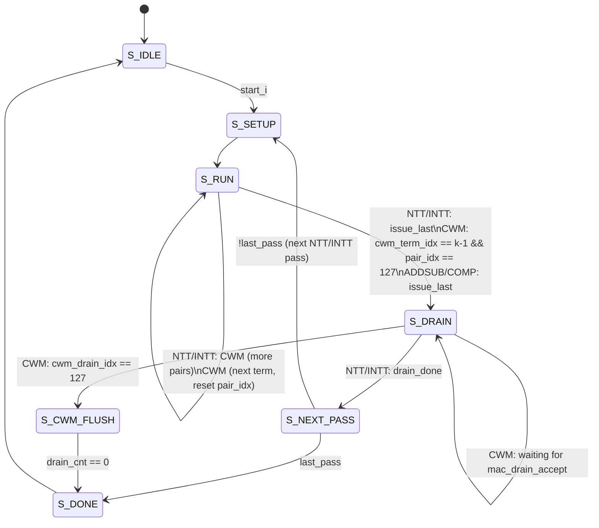

# Polynomial Arithmetic Unit — FSM: Controller State Machine

## 1. Overview

`pau_controller.sv` is the central sequencing FSM for the PAU. It controls memory read scheduling, twiddle-factor address generation, PE enable/mode, and the CWM scratchpad accumulator control plane. The FSM operates one job at a time, latching all job parameters from `start_i` and releasing `done_o` after the final writeback has drained through the pipeline.

## 2. State Diagram

## 3. State Definitions

| State | Encoding | Description & Key Actions |
| :--- | :--- | :--- |
| `S_IDLE` | `3'd0` | Default state. Awaits `start_i`. On assertion, latches `op_type_i`, `poly_id_i`, `cwm_num_terms_i`, `aux_poly_id_i`; resets all counters. Asserts `ready_o`. |
| `S_SETUP` | `3'd1` | 1-cycle setup. Pulses `tf_start_o` (if the mode uses twiddle factors). Transitions unconditionally to `S_RUN` after one cycle. |
| `S_RUN` | `3'd2` | Main issue phase. Each cycle `cmi_ready_i` is high, advances the block/butterfly counters and issues one CMI read. For CWM, sweeps 128 coefficient pairs per source term, then increments `cwm_term_idx_r` and loops until all k terms are done. |
| `S_DRAIN` | `3'd3` | Pipeline drain. **NTT/INTT**: counts down `wb_lat` cycles (pass-dependent, range 7–11) for the in-flight PE results to flush to CMI writeback. **CWM**: issues drain reads for the 128 e_hat pairs, advancing `cwm_drain_idx_r` each cycle that `cmi_ready_i & mac_drain_accept_i`. |
| `S_NEXT_PASS` | `3'd4` | NTT/INTT only. Checks `last_pass`. If not the final pass, increments `pass_idx_r`, resets counters, and returns to `S_SETUP`. If final pass, transitions to `S_DONE`. |
| `S_CWM_FLUSH` | `3'd6` | CWM only. After the final drain pair is issued, counts down 4 cycles to allow the last t_hat writeback to complete through the CMI delay pipeline before declaring done. |
| `S_DONE` | `3'd5` | 1-cycle terminal state. `done_o` is asserted. Returns unconditionally to `S_IDLE`. |

## 4. Transition Conditions

| Current State | Condition | Next State | Notes |
| :--- | :--- | :--- | :--- |
| `S_IDLE` | `start_i` | `S_SETUP` | Job parameters latched on this edge. |
| `S_SETUP` | (unconditional) | `S_RUN` | Always takes exactly 1 cycle. |
| `S_RUN` (NTT/INTT) | `cmi_ready_i & issue_last` | `S_DRAIN` | `issue_last = bf_last & block_last`. `drain_cnt_n` loaded with `wb_lat`. |
| `S_RUN` (CWM) | `cmi_ready_i & pair_idx == 127 & cwm_term_idx == k-1` | `S_DRAIN` | Final term, final pair. `cwm_drain_idx_r` reset to 0. |
| `S_RUN` (CWM) | `cmi_ready_i & pair_idx == 127 & cwm_term_idx < k-1` | `S_RUN` | Next term. `cwm_term_idx_r++`, `issue_addr_r` reset. |
| `S_RUN` (ADDSUB/COMP) | `cmi_ready_i & issue_last` | `S_DRAIN` | Single pass, `wb_lat` = 4 (ADDSUB) or 6 (COMP/DECOMP). |
| `S_DRAIN` (NTT/INTT) | `drain_done` (`drain_cnt_r == 0`) | `S_NEXT_PASS` | Writeback pipeline fully flushed. |
| `S_DRAIN` (CWM) | `cmi_ready_i & mac_drain_accept_i & cwm_drain_idx == 127` | `S_CWM_FLUSH` | All 128 e_hat pairs issued. `drain_cnt_n = 4`. |
| `S_DRAIN` (CWM) | `cmi_ready_i & mac_drain_accept_i & cwm_drain_idx < 127` | `S_DRAIN` | `cwm_drain_idx_r++`. |
| `S_NEXT_PASS` | `last_pass` | `S_DONE` | `last_pass` is true on NTT Pass 3 or INTT Pass 3. |
| `S_NEXT_PASS` | `!last_pass` | `S_SETUP` | `pass_idx_r++`, counters reset. |
| `S_CWM_FLUSH` | `drain_cnt_r == 0` | `S_DONE` | 4-cycle pipeline tail complete. |
| `S_DONE` | (unconditional) | `S_IDLE` | `done_o` is high for this 1 cycle. |

## 5. Control Outputs

All outputs from `pau_controller` are registered by 1 cycle before leaving the module (via `pe_ctrl_d1_r`, `pe_valid_d1_r`, `pass_is_radix2_d1_r`), providing a clean timing boundary between the FSM and the PE/CMI subsystems.

### 5.1 PE Control

| Output | Type | Active Condition | Description |
| :--- | :--- | :--- | :--- |
| `pe_ctrl_o` | Moore (delayed 1cc) | All states except `S_IDLE` | Driven from the latched `op_r` register. Constant for the entire job. |
| `pe_valid_o` | Mealy (delayed 1cc) | `S_RUN` when `cmi_ready_i` | Pulsed high for each accepted CMI read beat. Drives the PE pipeline enable. |
| `pass_is_radix2_o` | Moore (delayed 1cc) | NTT Pass 3 / INTT Pass 0 | Selects Radix-2 vs Radix-4 mode in `pe_unit`. Held active through drain. |
| `pass_idx_o` | Moore | All states | Current pass index (0–3) for NTT/INTT. Drives `tf_addr_gen`. |

### 5.2 Twiddle Factor Control

| Output | Type | Active Condition | Description |
| :--- | :--- | :--- | :--- |
| `tf_start_o` | Mealy | `S_SETUP` (if `pass_uses_tf`) or CWM entry | 1-cycle pulse to initialize `tf_addr_gen` for the current pass. |
| `tf_step_o` | Mealy | `S_RUN`, `issue_fire`, mode uses TF | Advances the ROM address by one position. For CWM, only advances on odd-numbered issue beats (every other cycle) to share one twiddle factor across two coefficient pairs. |

### 5.3 CWM Row Accumulator Control

| Output | Type | Active Condition | Description |
| :--- | :--- | :--- | :--- |
| `mac_issue_o` | Mealy | CWM, `S_RUN`, `issue_fire` | High for every accepted CWM coefficient pair beat. Used by `mac_row_accum` to gate accumulation. |
| `mac_first_term_o` | Mealy | CWM, `S_RUN`, first beat of term 0 | 1-cycle pulse when `cwm_term_idx == 0 & issue_addr == 0`. Signals the scratchpad to seed rather than accumulate. |
| `mac_pair_idx_o` | Moore | CWM, `S_RUN` | Current pair index [6:0] (0..127). Broadcast to `mac_row_accum` for scratchpad addressing. |
| `mac_drain_issue_o` | Mealy | CWM, `S_DRAIN`, `cmi_ready_i & mac_drain_accept_i` | Handshake signal. High when the controller is issuing a drain (e_hat) read and the accumulator is ready to accept the next pair. |
| `mac_drain_idx_o` | Moore | CWM, `S_DRAIN` | Drain pair index [6:0] (0..127). Broadcast to `mac_row_accum`. |
| `mac_fuse_e_o` | Moore | CWM, `S_DRAIN` | Held high for the entire drain sweep. Instructs `mac_row_accum` to add e_hat to the accumulated pair before emitting it. |

### 5.4 CMI Interface Control

| Output | Type | Active Condition | Description |
| :--- | :--- | :--- | :--- |
| `cmi_v_o` | Moore | `S_RUN` always; `S_DRAIN` (CWM only) | Enables the CMI to assert `pau_req_o` to memory. |
| `cmi_rd_en_o` | Mealy | `S_RUN` + `cmi_ready_i`; CWM drain + handshake | Read-enable strobe to CMI; drives `pau_rd_en_o`. |
| `cmi_poly_id_o` | Moore | All job states | Polynomial ID for the primary read port. In CWM: equals `cwm_term_idx_r` (walks A slots); in drain: equals `POLY_ID_EI`. For all other modes: the latched `poly_id_r`. |
| `cmi_aux_v_o` | Moore | `S_RUN`, CWM or ADDSUB only | Enables the CMI auxiliary port. Driven low for NTT/INTT/COMP. |
| `cmi_aux_rd_en_o` | Mealy | `cmi_aux_v_o & cmi_ready_i` | Read-enable for the auxiliary port. |
| `cmi_aux_poly_id_o` | Moore | CWM or ADDSUB | Auxiliary polynomial ID. For CWM: s slot (= `cwm_term_idx_r`, mapped to `POLY_ID_S0 + slot` in CMI). For ADDSUB: the latched `aux_poly_id_r`. |
| `cmi_coeff_idx_o` | Mealy | `S_RUN` and `S_DRAIN` | Four 8-bit coefficient indices computed from the block/butterfly counters per the pass schedule. |
| `cmi_coeff_valid_o` | Mealy | `S_RUN`, `S_DRAIN` | 4-bit lane mask. NTT/INTT/ADDSUB: `4'b1111`. CWM RUN/DRAIN: `4'b0011` (only lanes 0 and 1). |
| `cmi_wb_latency_o` | Moore | All job states | Selects the writeback delay tap in CMI. Values: 4cc (ADDSUB), 6cc (COMP/DECOMP), 7cc (NTT Pass 3 / INTT Pass 0), 11cc (NTT Passes 0–2 / INTT Passes 1–3 / CWM RUN), 4cc (CWM DRAIN/FLUSH). |

## 6. Latency & Stall Conditions

### 6.1 Per-Mode Writeback Latency (`wb_latency_i`)

| Mode | Pass / Phase | `wb_latency_i` | Derivation |
| :--- | :--- | :--- | :--- |
| NTT | Passes 0–2 (Radix-4) | `4'd11` | 1cc CMI read + 8cc PE cascade + 1cc top pipe + 1cc CMI align |
| NTT | Pass 3 (Radix-2) | `4'd7` | 1cc CMI + 4cc PE + 1cc top pipe + 1cc CMI |
| INTT | Pass 0 (Radix-2) | `4'd7` | Same as NTT Pass 3 |
| INTT | Passes 1–3 (Radix-4) | `4'd11` | Same as NTT Passes 0–2 |
| ADDSUB | (single pass) | `4'd4` | 1cc CMI + 1cc PE + 1cc top pipe + 1cc CMI |
| COMP/DECOMP | (single pass) | `4'd6` | 1cc CMI + 3cc PE + 1cc top pipe + 1cc CMI |
| CWM | RUN phase | `4'd11` | CWM has no direct writeback during accumulate |
| CWM | DRAIN/FLUSH phase | `4'd4` | 1cc e_hat read + 1cc mac_row_accum fuse + 1cc top pipe + 1cc CMI |

### 6.2 Expected Execution Cycles Per Mode

| Mode | Operation Cycles | Drain Cycles | Total (excl. memory stalls) |
| :--- | :--- | :--- | :--- |
| NTT | 4 × 64 = 256 issue beats across 4 passes | 11cc (pass 0–2) + 7cc (pass 3) | ~270 cycles |
| INTT | 4 × 64 = 256 issue beats across 4 passes | 7cc (pass 0) + 11cc (passes 1–3) | ~270 cycles |
| ADDSUB | 64 issue beats | 4cc | ~70 cycles |
| CWM (k=3) | 3 × 128 = 384 issue beats + 128 drain beats | 4cc flush | ~520 cycles |

### 6.3 Stall Behavior

* If `pau_stall_i` asserts during `S_RUN`, `cmi_ready_i` goes low. The FSM holds its current counter values and re-issues the same read address next cycle.
* If `pau_stall_i` asserts during CWM `S_DRAIN`, both `cwm_drain_issue` and `mac_drain_accept_i` go low, freezing `cwm_drain_idx_r` and the drain output register.
* There is no deadlock path: the FSM only advances on accepted handshakes. Stalls do not cause dropped beats.
