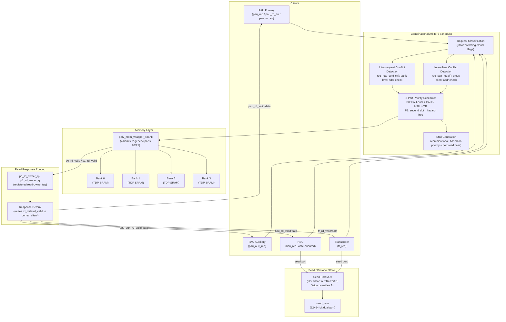

# Poly-Mem Subsystem Datapath & Microarchitecture

## 1. Overview

The `poly_mem_subsystem` datapath routes polynomial coefficient read/write requests from three external clients (PAU, HSU, Transcoder) through a combinational priority arbiter and hazard detector, then drives a dual-port 4-bank SRAM wrapper (`poly_mem_wrapper_4bank`). A separate dual-port seed RAM (`seed_ram`) handles the seed/protocol store independently. Physical data is 16 bits wide; meaningful coefficient data is the lower 12 bits (q = 3329 < 2^12).

---

## 2. Block Diagram



---

## 3. Memory Array Layout

### 3.1 Physical Structure

- **Total polynomials:** `NUM_POLYS = 32`
- **Coefficients per polynomial:** `NCOEFF = 256`
- **Physical word width:** `W = 16` bits (only lower 12 bits used)
- **Banks:** 4 true-dual-port (TDP) SRAMs (`poly_ram_bank` instances)
- **Lanes per request:** 4 coefficients addressed independently per cycle
- **Total physical capacity:** 32 polys × 256 coefficients × 16 bits = 131,072 bits = 16 KiB

### 3.2 Coefficient-to-Bank Mapping

Each coefficient at index `order` (0–255) is mapped to a bank using a **bit-pair sum hash**:

```
bank = (order[1:0] + order[3:2] + order[5:4] + order[7:6]) mod 4
```

This distributes consecutive and stride-4 coefficient patterns across banks, reducing bank conflicts for NTT butterfly access patterns. The row address within that bank is:

```
row = order >> 2      (i.e., order / 4)
bank_addr = poly_id * (NCOEFF / 4) + row
         = poly_id * 64 + row
```

So each polynomial occupies 64 rows per bank. Bank depth = 32 × 64 = 2048 rows.

### 3.3 Fixed Polynomial Slot Map

Defined in `qrem_mem_map_pkg`:

| Poly ID | Symbol | Usage |
| :--- | :--- | :--- |
| 0–3 | `POLY_ID_S0`–`S3` | Secret vector ŝ (overwritten by PAU with ŝ in-place) |
| 4 | `POLY_ID_EI` | Active row-error scratch / ê_i |
| 5–8 | `POLY_ID_A0`–`A3` | Active A-hat row buffer (A_hat[i][j] for current i) |
| 9–12 | `POLY_ID_T0`–`T3` | Final t-hat values (output of KeyGen NTT phase) |
| 13–31 | `POLY_ID_WORK0`–`WORK18` | General-purpose controller work region |

---

## 4. Arbiter / Scheduler

### 4.1 Request Classification

Each client's request is classified into `rd_req`, `wr_req`, `both_req` (illegal), and `single_req` (one operation only) flags. The PAU also computes `dual_req` (both primary and auxiliary active) and `dual_valid` (dual legal: each descriptor is pure rd or wr, not both).

HSU adds an extra classification step:
- `hsu_rd_t_slot_req`: poly_id ∈ {T0, T1, T2, T3}
- `hsu_rd_allowed_req`: T-slot read AND `hsu_hash_ek_read_en` AND no simultaneous write
- `hsu_poly_rd_unsupported`: any other HSU read → forces stall

### 4.2 Intra-Request Conflict Detection (`req_has_conflict`)

Checks if any two enabled lanes within a single request map to the **same bank**. If two lanes of the same 4-lane request target the same bank, the request has an intra-conflict and will be stalled/rejected. This check is purely combinational on the request address inputs.

### 4.3 Inter-Client Conflict Detection (`req_pair_legal`)

Before scheduling two clients on P0 and P1, checks that no lane from client A and client B map to the same `(bank, bank_addr)` with at least one being a write. Two simultaneous reads to the same address are always legal. Any RW or WW to the same address across ports is illegal.

### 4.4 Priority Scheduler

The scheduler is a purely combinational `always_comb` block that resolves which client(s) drive P0 and P1 each cycle:

```
Priority order for P0:
  1. Wipe FSM (if wipe_active)
  2. PAU dual-port (pau_dual_can_issue): PAU-primary → P0, PAU-auxiliary → P1
  3. Combo-owner (combo_any): client with both rd+wr in same cycle → P0(rd) + P1(wr)
  4. PAU single → P0
  5. HSU single → P0
  6. TR single  → P0

If P0 is assigned, scheduler attempts to fill P1 with a different client:
  (P0 owner is not PAU) && PAU available && no cross-conflict → PAU → P1
  (P0 owner is not HSU) && HSU available && no cross-conflict → HSU → P1
  (P0 owner is not TR)  && TR available  && no cross-conflict → TR  → P1
```

**Combo-owner path:** If a single client requests both `rd_en` and `wr_en` simultaneously (only legal for PAU and TR), it takes both ports in the same cycle — P0 for the read and P1 for the write. This path is mutually exclusive with PAU dual-port mode.

### 4.5 Read Owner Tagging

When a read fires on P0 or P1, the scheduler records which client owns that read in `p0_rd_owner_q` / `p1_rd_owner_q` (registered). One cycle later, when the memory wrapper returns `p0_rd_valid` / `p1_rd_valid`, the stored tag is used to route the data to the correct client output.

Tags: `OWNER_NONE(0)`, `OWNER_PAU(1)`, `OWNER_PAU_AUX(2)`, `OWNER_HSU(3)`, `OWNER_TR(4)`.

---

## 5. Stall Generation

Stall signals are generated combinationally from the priority schedule and port-readiness signals:

| Client | Stall Condition |
| :--- | :--- |
| All (wipe) | `wipe_active` → all stalls forced high |
| PAU (dual mode) | `!(pau_dual_possible && p0_ready && p1_ready)` |
| PAU (single mode) | `!pau_possible || !p0_ready` |
| HSU | PAU takes both ports → forced stall; PAU on P0 → conflict check + `p1_ready`; else → `!hsu_possible \|\| !p0_ready` |
| TR | All ports occupied by PAU/HSU → forced stall; combo TR → `p0_ready && p1_ready`; PAU on P0 → conflict + `p1_ready`; HSU on P0 → conflict + `p1_ready`; else → `!tr_possible \|\| !p0_ready` |

> **`p0_ready` / `p1_ready` from the wrapper** deassert when the wrapper detects an intra-request bank conflict or same-address hazard. Under correct scheduling, these should never deassert; if they do, `mem_fault_o` will also assert.

---

## 6. Seed Store Datapath

- **RAM:** `seed_ram` — 32-entry × 64-bit, synchronous read (1-cycle latency), true-dual-port (Port A = HSU, Port B = Transcoder).
- **Address translation:** `qrem_seed_map_pkg::seed_word_addr(seed_id, beat)` → linear word address.
- **HSU path (Port A):** `hsu_seed_req && hsu_seed_we` → write; `hsu_seed_req && !hsu_seed_we` → read. The wipe FSM overrides Port A during `WIPE_SEED`.
- **TR path (Port B):** `tr_seed_req && tr_seed_we` → write; `tr_seed_req && !tr_seed_we` → read. No wipe override.
- **Read latency:** 1 cycle. `hsu_seed_rvalid` / `tr_seed_rvalid` are the registered versions of the `*_seed_read_fire` signals.
- **Gating:** Both ports gated by `seed_access_ready = ~rst && ~wipe_active`. No ready/stall protocol — clients must poll `*_seed_ready` before issuing.

---

## 7. Critical Path Analysis

The longest combinational paths in the arbiter are:

- **`req_pair_legal()`** double loop (4×4 = 16 iterations) computing bank index + bank address for both ports and comparing them — used in both stall generation and the P1-slot scheduling decision.
- **Stall generation for TR:** depends on `pau_dual_can_issue` (which depends on `req_pair_legal` for the dual pair) before determining HSU conflict, then TR conflict. This is a 3-level deep combinational dependency.
- **`p0_ready` / `p1_ready`** are also combinational from the wrapper's 4×4 conflict loop, and are used in the stall outputs.

These paths should be the primary LTP bottleneck for this module. Pipelining the arbiter would require a 1-cycle request staging register.

---

## 8. Hardware Parameters & Area Notes

- **4-bank structure:** Required by the bit-pair-sum bank mapping. Changing `NUM_BANKS` requires redesigning the hash function and the conflict detection loops.
- **4-lane parallel access:** Each generic port can address 4 coefficients per cycle, matching the PAU's 4-wide PE array data bus.
- **Seed RAM sizing:** 32 × 64-bit = 256 bytes. Intentionally minimal — fits in LUTRAM on FPGAs. Holds all 8 ML-KEM 256-bit protocol objects simultaneously (no eviction needed during a single operation phase).
- **Physical coefficient width:** 16 bits (`W=16`) despite valid data being 12 bits. This is a RAM-inference-friendly width that avoids partial-byte writes on most FPGA primitives. The 4-bit overhead is acceptable given the small total capacity.
