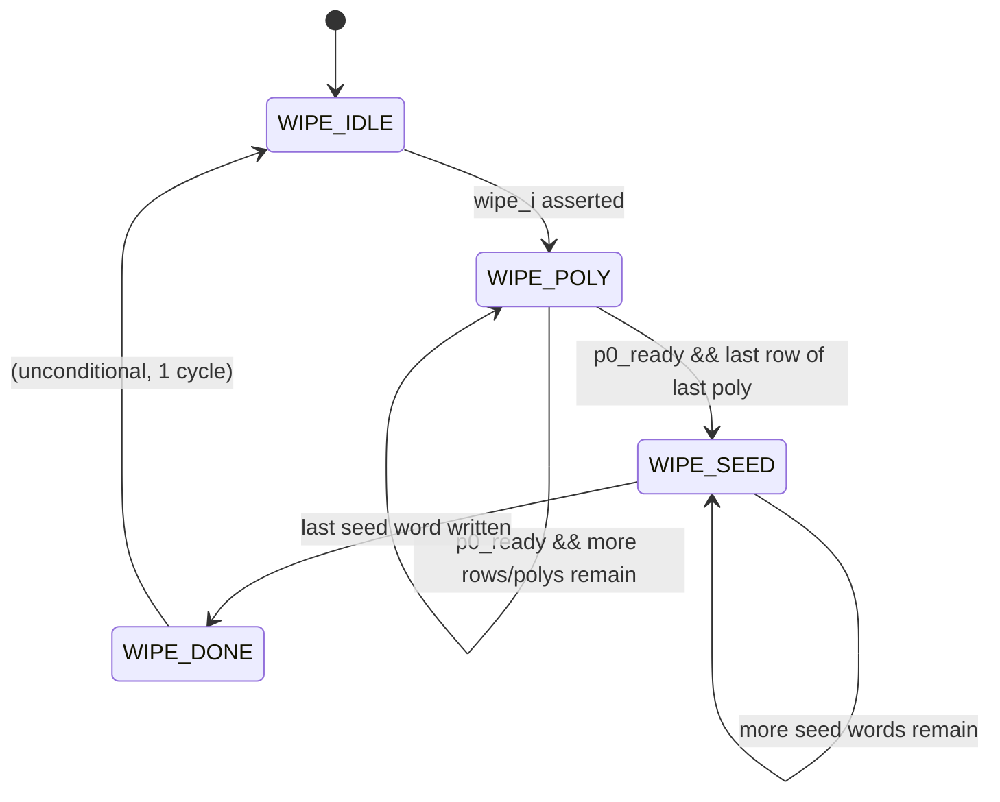

# Poly-Mem Subsystem FSM: Security Wipe Controller

## 1. Overview

The Wipe FSM (`wipe_state_q`) controls the sequential zero-fill of all polynomial memory slots and the seed/protocol store in response to a `wipe_i` pulse from the Main Controller. During an active wipe, all three polynomial-memory client stall signals are permanently asserted and no client requests are serviced.

---

## 2. State Diagram

---

## 3. State Definitions

| State | Encoding | Description & Key Actions |
| :--- | :--- | :--- |
| `WIPE_IDLE` | `2'd0` | Default/reset state. Monitors `wipe_i`. All client stalls de-asserted (unless wipe_active). Memory is accessible to clients. |
| `WIPE_POLY` | `2'd1` | Iterates over all polynomial slots and rows, issuing zero-write operations through generic port 0 (P0). Stalls all clients for the duration. Uses `wipe_poly_q` (0–31) and `wipe_row_q` (0–`ROWS_PER_POLY_BANK`-1 = 63) as counters. Each accepted write (when `p0_ready`) increments the counters. |
| `WIPE_SEED` | `2'd2` | Iterates over all 32 seed store words (via Port A of `seed_ram`), zeroing each word. Uses `wipe_seed_q` (0–31) as a counter. Each cycle unconditionally advances the counter (seed port has no ready/stall). |
| `WIPE_DONE` | `2'd3` | Single-cycle pulse state. Asserts `wipe_done_o = 1` and immediately transitions back to `WIPE_IDLE`. |

---

## 4. Transition Conditions

| Current State | Condition | Next State | Notes |
| :--- | :--- | :--- | :--- |
| `WIPE_IDLE` | `wipe_i == 1` | `WIPE_POLY` | Resets all three counters (`wipe_poly_q`, `wipe_row_q`, `wipe_seed_q`) to 0 on the next clock edge. |
| `WIPE_POLY` | `p0_ready && wipe_row_q < ROWS_PER_POLY_BANK-1` | `WIPE_POLY` | Increments `wipe_row_q`. |
| `WIPE_POLY` | `p0_ready && wipe_row_q == ROWS_PER_POLY_BANK-1 && wipe_poly_q < NUM_POLYS-1` | `WIPE_POLY` | Resets `wipe_row_q` to 0, increments `wipe_poly_q`. |
| `WIPE_POLY` | `p0_ready && wipe_row_q == ROWS_PER_POLY_BANK-1 && wipe_poly_q == NUM_POLYS-1` | `WIPE_SEED` | All 32 polynomials × 64 rows zeroed. Resets both counters. |
| `WIPE_POLY` | `!p0_ready` | `WIPE_POLY` | Stalls in place. Counters do not advance. |
| `WIPE_SEED` | `wipe_seed_q < SEED_DEPTH-1` | `WIPE_SEED` | Increments `wipe_seed_q` every cycle (seed RAM has no ready backpressure). |
| `WIPE_SEED` | `wipe_seed_q == SEED_DEPTH-1` | `WIPE_DONE` | All 32 seed words zeroed. |
| `WIPE_DONE` | (always) | `WIPE_IDLE` | Unconditional 1-cycle transition. |

---

## 5. Control Outputs

| Output Signal | Type | Active State(s) | Description |
| :--- | :--- | :--- | :--- |
| `wipe_busy_o` | Moore | `WIPE_POLY`, `WIPE_SEED`, `WIPE_DONE` | Combinational: `wipe_active = (wipe_state_q != WIPE_IDLE)`. |
| `wipe_done_o` | Moore | `WIPE_DONE` | Pulses high for exactly one cycle, then deasserts as FSM returns to `WIPE_IDLE`. |
| `pau_stall` | Moore | Any `wipe_active` | Forces high unconditionally during any non-IDLE wipe state. |
| `hsu_stall` | Moore | Any `wipe_active` | Forces high unconditionally during any non-IDLE wipe state. |
| `tr_stall` | Moore | Any `wipe_active` | Forces high unconditionally during any non-IDLE wipe state. |
| P0 write to poly mem | Moore | `WIPE_POLY` | Drives `p0_poly_id_mux = wipe_poly_q`, `p0_wr_en_mux = 4'b1111`, `p0_data_mux = 0`, all 4 lanes addressed at `{wipe_row_q, 2'b00}` + lane offset. |
| Seed Port A write | Moore | `WIPE_SEED` | Drives `seed_a_we_mux = 1`, `seed_a_addr_mux = wipe_seed_q`, `seed_a_wdata_mux = 0`. Overrides the HSU seed port. |
| `seed_access_ready` | Moore | `WIPE_IDLE` (non-wipe, non-reset) | Combinational: `~rst && ~wipe_active`. Both seed ports report not-ready to clients during wipe. |

---

## 6. Latency & Coverage

- **Polynomial wipe time:** `NUM_POLYS × ROWS_PER_POLY_BANK` write cycles = `32 × 64 = 2048` cycles minimum (may be longer if `p0_ready` deasserts, though no other client can steal the port during wipe).
- **Seed wipe time:** `SEED_DEPTH = 32` cycles (unconditional, one word per cycle, no backpressure from seed RAM).
- **Total minimum wipe time:** `2048 + 32 + 1 (WIPE_DONE) = 2081` cycles from `wipe_i` assertion to `wipe_done_o` pulse.
- **Re-entry:** A new `wipe_i` pulse during an active wipe is ignored (only checked in `WIPE_IDLE`).
