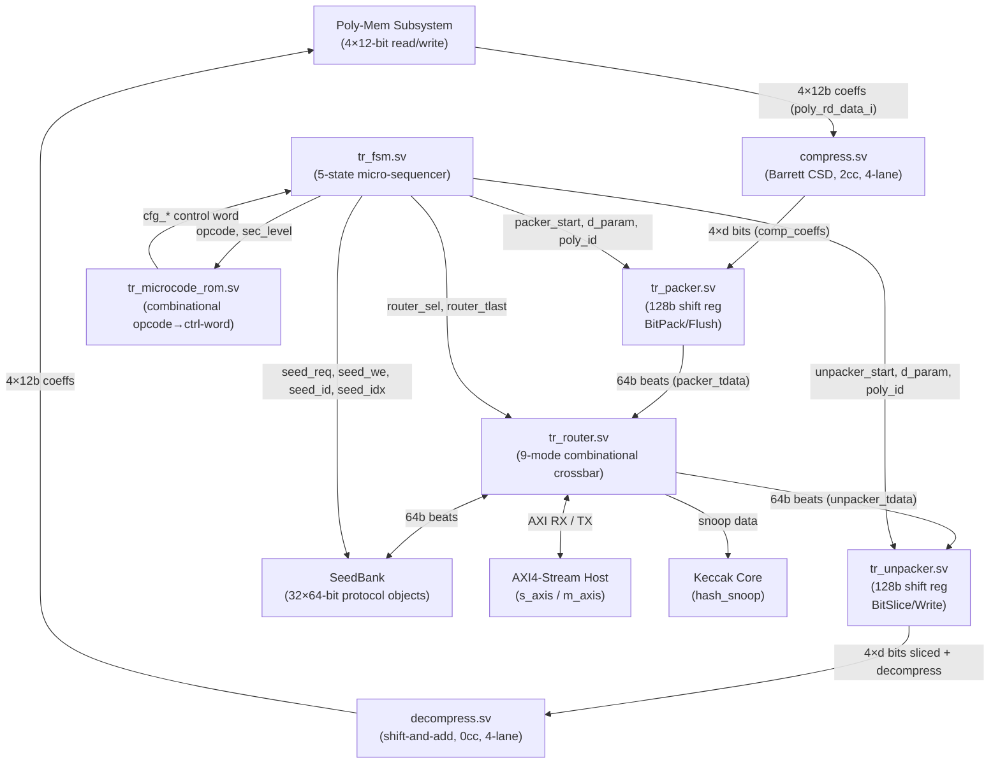

# Transcoder Unit — Datapath & Microarchitecture

## 1. Overview

The Transcoder datapath is a **Decoupled Dual-Datapath** architecture consisting of two independent variable-stride gearboxes (Packer and Unpacker), a purely combinational 9-mode crossbar router, and two 4-lane math modules (compress and decompress). The Packer implements ByteEncode_d by reading 4 coefficients per cycle from polynomial memory, compressing them to d bits each via a 2-stage Barrett CSD pipeline, and accumulating the results in a 128-bit shift register before emitting 64-bit AXI-Stream beats. The Unpacker implements ByteDecode_d symmetrically: absorbing 64-bit beats into a shift register, slicing d-bit chunks, decompressing them to 12-bit coefficients via a combinational function, and writing 4 coefficients per cycle to polynomial memory.

## 2. Block Diagram



## 3. Packer Pipeline (ByteEncode_d + Compress_d)

The Packer pipeline processes one group of 4 coefficients per cycle in steady state, with a 2-cycle latency introduced by the `compress` module.

| Cycle | Stage | Operation |
| :--- | :--- | :--- |
| 0 | **PolyMem Read Issue** | `poly_rd_en_o` asserted. Indices `{rd_counter, 2'b00..11}` sent to memory. `rd_counter` incremented. `inflight_bits += bits_per_cycle`. |
| 1 | **PolyMem Response + Compress Stage 1** | `poly_rd_valid_i` returns data. Registered into compress Stage 1: CSD Barrett partial product computed (`xM_comb`). `poly_rd_valid_q` set. |
| 2 | **Compress Stage 2 + Shift Register Push** | Compress Stage 2 produces `packed_4d` (4×d valid bits). `inflight_bits -= bits_per_cycle`. Shift register push: `shift_reg |= packed_4d << bit_count`. `bit_count += bits_per_cycle`. |
| — | **AXI-TX Drain** | Whenever `bit_count >= 64`, `m_tvalid_o` is asserted. On fire: `shift_reg >>= 64`, `bit_count -= 64`. Push and pop may occur simultaneously. |

**In-flight bit overflow prevention**: The `stall_read` signal prevents new memory reads when `bit_count + inflight_bits + bits_per_cycle > 128`. This ensures the 128-bit shift register never overflows even during sustained AXI-TX backpressure.

## 4. Unpacker Pipeline (ByteDecode_d + Decompress_d)

The Unpacker pipeline processes one group of 4 coefficients per cycle in steady state. Decompress is purely combinational (0cc latency).

| Cycle | Stage | Operation |
| :--- | :--- | :--- |
| 0 | **AXI-RX Ingest** | 64-bit beat fires. `shift_reg |= (s_tdata & 64'hFFFF...) << bit_count`. `bit_count += 64`. Mask applied to prevent upper-bit corruption. |
| 0 | **Bit Slice** | Combinational: `sliced_bits = shift_reg[47:0]`. Slicer extracts 4×d-bit groups from LSBs and zero-pads each to 12 bits → `decomp_in[3:0]`. |
| 0 | **Decompress** | Combinational: `decompress` module computes `Decompress_d(decomp_in)` → `decomp_out[3:0]`. |
| 0 | **PolyMem Write** | If `mem_wr_fire`: `poly_wr_en_o = 4'b1111`, write `decomp_out` to memory. `shift_reg >>= bits_per_cycle`. `bit_count -= bits_per_cycle`. `wr_counter++`. |

> [!NOTE]
> The push (AXI ingest) and pop (memory write) are computed in a single combinational `next_shift_reg` block and applied simultaneously at the register boundary. There is no ordering hazard — the pop reads from the *current* `shift_reg`, and the push ORs new bits at position `next_bit_count` (post-pop).

**Backpressure**: `s_tready_o = (bit_count <= 64) & (state == ST_INGEST)`. AXI acceptance is blocked when the shift register holds more than 64 bits (the slicer needs up to 48 bits in the worst case, and the register is 128 bits total, so the invariant ensures at least 64 bits of headroom for the next beat before accepting one).

## 5. Compress Module (Barrett CSD, 2-stage pipeline)

**Formula**: `Compress_d(x) = round(2^d × x / q) mod 2^d`, where `q = 3329`.

Implemented via **Barrett reduction** with a hand-optimized CSD (Canonical Signed Digit) decomposition of the Barrett constant M = 161271.

**CSD decomposition of M**:
```
M = 161271
  = 2^17 + 2^15 - 2^11 - 2^9 - 2^3 - 2^0
  = 5×(2^15) - 5×(2^9) - 9×(2^0)
```

This decomposition is implemented using only shifts and 3-operand additions/subtractions, avoiding a full multiplier for M.

### Stage 1 (Sequential — cuts the CSD adder tree)

| Signal | Width | Computation |
| :--- | :--- | :--- |
| `x_mul_5` | 15b | `(x << 2) + x` |
| `x_mul_9` | 15b | `(x << 3) + x` |
| `sub1` | 24b | `(x_mul_5 << 6) - x_mul_5` |
| `xM_comb` | 29b | `(sub1 << 9) - x_mul_9` |

All four computed combinationally, then registered (`x1_reg`, `xM1_reg`, `d1_reg`).

### Stage 2 (Combinational — shift, round, mask)

Applies case-based **static shifts** (not variable shifter — avoids shift-multiplexer logic depth):

| d | Shift applied to `xM1_reg` | Rounding constant | Mask |
| :--- | :--- | :--- | :--- |
| 4 | `<< 4` | +268354944 | `12'h00F` |
| 5 | `<< 5` | +268354944 | `12'h01F` |
| 10 | `<< 10` | +268354944 | `12'h3FF` |
| 11 | `<< 11` | +268354944 | `12'h7FF` |

`coeff_o[i] = ((shifted_xM[i] + 268354944) >> 29) & mask`

**Special cases** (bypass normal Barrett):
- `d=12`: Passthrough — `coeff_o = x` (no compression).
- `d=1`: Threshold — `coeff_o = 1` if `833 ≤ x ≤ 2496`, else `0`. (Implements the 1-bit rounding midpoint for binary message encoding.)

**Properties**: 2-stage sequential pipeline, 4-lane parallel (identical logic for lanes 0–3), 1-cycle steady-state throughput.

## 6. Decompress Module (Combinational, 4-lane)

**Formula**: `Decompress_d(y) = round(q × y / 2^d)`, where `q = 3329`.

Implemented as `q = 3329 = 2^11 + 2^10 + 2^8 + 1`, using case-based static shifts with exact per-case bit-width sizing:

| d | Intermediate width | Computation | Rounding |
| :--- | :--- | :--- | :--- |
| 4 | 16b | `qy = (y<<11) + (y<<10) + (y<<8) + y` | `(qy + 8) >> 4` |
| 5 | 17b | `qy = (y<<11) + (y<<10) + (y<<8) + y` | `(qy + 16) >> 5` |
| 10 | 22b | `qy = (y<<11) + (y<<10) + (y<<8) + y` | `(qy + 512) >> 10` |
| 11 | 23b | `qy = (y<<11) + (y<<10) + (y<<8) + y` | `(qy + 1024) >> 11` |

**Special cases**:
- `d=12`: Passthrough — `coeff_o = y`.
- `d=1`: `coeff_o = 1665` if `y[0]`, else `0`. (1665 = round(q/2) — maps the 1-bit message back to a coefficient near q/2.)

**Properties**: Purely combinational, 0cc latency, 4-lane parallel via `generate` + function call. No variable shifter — all shifts are static within each `case` branch. Intermediate bit widths are sized exactly to their theoretical maximum to minimize LUT depth.

## 7. Dynamic Bit Packing / Slicing

Both gearboxes support the same set of d values, determined by ML-KEM security level and the type of polynomial being packed/unpacked:

| d | Context | bits_per_cycle (4×d) | AXI beats per 256-coeff poly (256×d/64) |
| :--- | :--- | :--- | :--- |
| 1 | Message encode/decode (μ) | 4 | 4 |
| 4 | Ciphertext v (ML-KEM-512/768) | 16 | 16 |
| 5 | Ciphertext v (ML-KEM-1024) | 20 | 20 |
| 10 | Ciphertext u (ML-KEM-512/768) | 40 | 40 |
| 11 | Ciphertext u (ML-KEM-1024) | 44 | 44 |
| 12 | Keys (s, t) — no compression | 48 | 48 |

> [!NOTE]
> 256 × d is always divisible by 64 for all supported d values. This means the packed output always contains an exact integer number of 64-bit AXI beats with no padding or partial-word termination. `tkeep` is permanently `8'hFF` as a result.

**Packer bit packing** (`packed_4d` construction): Lane 0 occupies the absolute LSBs; lane 3 occupies the MSBs of the d×4-bit word. Bit ordering matches FIPS 203 ByteEncode (little-endian coefficient, LSB-first within each coefficient).

**Unpacker bit slicing** (`sliced_bits` extraction): Always reads `shift_reg[47:0]` (48 bits — sufficient for worst-case d=12). Each lane's d bits are extracted at a fixed offset `i*d`, then zero-padded to 12 bits:
```
decomp_in[i] = {(12-d)'d0, sliced_bits[i*d + d-1 : i*d]}
```

## 8. Router Crossbar Modes

`tr_router` is a purely combinational 9-mode crossbar controlled by `router_sel_i` from the FSM. It manages all AXI4-Stream backpressure.

| Mode | `router_sel_t` | Value | Source | Destination(s) | Backpressure |
| :--- | :--- | :--- | :--- | :--- | :--- |
| `TR_ROUTER_IDLE` | — | `4'b0000` | None | None (all outputs zeroed) | N/A |
| `TR_ROUTER_MATH_TX` | — | `4'b0001` | Packer | AXI-TX | `packer_tready = m_axis_tready` |
| `TR_ROUTER_MATH_TX_SNOOP` | — | `4'b0010` | Packer | AXI-TX + Hash Snoop | `packer_tready = m_axis_tready & hash_snoop_ready_i` |
| `TR_ROUTER_MATH_RX` | — | `4'b0011` | AXI-RX | Unpacker | `s_axis_tready = unpacker_tready` |
| `TR_ROUTER_MATH_RX_SNOOP` | — | `4'b0100` | AXI-RX | Unpacker + Hash Snoop | `s_axis_tready = unpacker_tready & hash_snoop_ready_i` |
| `TR_ROUTER_BYPASS_TX` | — | `4'b0101` | SeedBank | AXI-TX | None (FSM shields latency) |
| `TR_ROUTER_BYPASS_RX` | — | `4'b0110` | AXI-RX | SeedBank | `s_axis_tready = seed_ready_i` |
| `TR_ROUTER_MATH_RX_FROM_SEEDBANK` | — | `4'b0111` | SeedBank | Unpacker | Internal crossbar (EN_MSG_DEC) |
| `TR_ROUTER_MATH_TX_TO_SEEDBANK` | — | `4'b1000` | Packer | SeedBank | `packer_tready = seed_ready_i` |

> [!IMPORTANT]
> In `MATH_TX_SNOOP` and `MATH_RX_SNOOP` modes, the source's ready is the AND of **all** destination readys. A slow Keccak core will stall the AXI-RX stream and pause the Unpacker simultaneously. Both consumers receive identical data — there is no FIFO buffering between them.

> [!NOTE]
> `m_axis_tkeep_o` and `hash_snoop_keep_o` are permanently tied to `8'hFF` inside `tr_router` as static assignments, not through the case logic. This is unconditional.

## 9. Microcode ROM — Opcode Control Word Table

`tr_microcode_rom` is a purely combinational function of `(opcode_i, sec_level_i)`. It emits a wide control word that completely determines the FSM's execution plan for a given instruction. Below is the full decoded output for all 21 opcodes (security-level-independent fields shown; `cfg_du`/`cfg_dv` resolved per §3 of `README.md`).

| Opcode | `math_en` | `is_tx` | `math_k_loop` | `internal_math_en` | `d_param` | `poly_base_id` | `bypass_en` | `seed_id` | `bypass_beats` | `router_math_sel` | `router_bypass_sel` |
| :--- | :--- | :--- | :--- | :--- | :--- | :--- | :--- | :--- | :--- | :--- | :--- |
| `TR_OP_IDLE` | 0 | — | — | — | — | — | 0 | — | — | IDLE | IDLE |
| `TR_OP_KG_INGEST_D` | 0 | — | — | — | — | — | 1 | `SEED_ID_D` | 4 | IDLE | BYPASS_RX |
| `TR_OP_KG_EXPORT_DK_PKE` | 1 | TX | 1 | 0 | 12 | MEM_S (0) | 0 | — | — | MATH_TX | IDLE |
| `TR_OP_KG_EXPORT_EK_PKE_1` | 1 | TX | 1 | 0 | 12 | MEM_T (4) | 0 | — | — | MATH_TX | IDLE |
| `TR_OP_KG_EXPORT_EK_PKE_2` | 0 | — | — | — | — | — | 1 | `SEED_ID_RHO` | 4 | IDLE | BYPASS_TX |
| `TR_OP_KG_EXPORT_HEK` | 0 | — | — | — | — | — | 1 | `SEED_ID_HEK` | 4 | IDLE | BYPASS_TX |
| `TR_OP_EN_INGEST_M` | 0 | — | — | — | — | — | 1 | `SEED_ID_M` | 4 | IDLE | BYPASS_RX |
| `TR_OP_EN_INGEST_EK_1` | 1 | RX | 1 | 0 | 12 | MEM_T (4) | 0 | — | — | MATH_RX | IDLE |
| `TR_OP_EN_INGEST_EK_2` | 0 | — | — | — | — | — | 1 | `SEED_ID_RHO` | 4 | IDLE | BYPASS_RX |
| `TR_OP_EN_MSG_DEC` | 1 | RX | 0 | 1 | 1 | MEM_MU (20) | 0 | `SEED_ID_M` | — | MATH_RX_FROM_SEEDBANK | IDLE |
| `TR_OP_EN_EXPORT_CT_1` | 1 | TX | 1 | 0 | `cfg_du` | MEM_U (8) | 0 | — | — | MATH_TX | IDLE |
| `TR_OP_EN_EXPORT_CT_2` | 1 | TX | 0 | 0 | `cfg_dv` | MEM_V (12) | 0 | — | — | MATH_TX | IDLE |
| `TR_OP_EN_EXPORT_K` | 0 | — | — | — | — | — | 1 | `SEED_ID_K` | 4 | IDLE | BYPASS_TX |
| `TR_OP_DC_INGEST_DK_PKE` | 1 | RX | 1 | 0 | 12 | MEM_S (0) | 0 | — | — | MATH_RX | IDLE |
| `TR_OP_DC_INGEST_C1` | 1 | RX | 1 | 0 | `cfg_du` | MEM_U (8) | 0 | — | — | MATH_RX_SNOOP | IDLE |
| `TR_OP_DC_INGEST_C2` | 1 | RX | 0 | 0 | `cfg_dv` | MEM_V (12) | 0 | — | — | MATH_RX_SNOOP | IDLE |
| `TR_OP_DC_INGEST_Z` | 0 | — | — | — | — | — | 1 | `SEED_ID_Z` | 4 | IDLE | BYPASS_RX |
| `TR_OP_DC_MSG_ENC` | 1 | TX | 0 | 1 | 1 | MEM_W (16) | 0 | `SEED_ID_M` | — | MATH_TX_TO_SEEDBANK | IDLE |
| `TR_OP_DC_EXPORT_K` | 0 | — | — | — | — | — | 1 | `SEED_ID_K` | 4 | IDLE | BYPASS_TX |
| `TR_OP_DC_EXPORT_K_BAR` | 0 | — | — | — | — | — | 1 | `SEED_ID_K_BAR` | 4 | IDLE | BYPASS_TX |
| `TR_OP_DC_EXPORT_R` | 0 | — | — | — | — | — | 1 | `SEED_ID_R` | 4 | IDLE | BYPASS_TX |

**Polynomial memory slot assignments** (fixed in ROM):

| Symbol | Base Slot ID | Polynomial(s) | Used by |
| :--- | :--- | :--- | :--- |
| `MEM_S` | 5'd0 | s̃[0..k-1] | KG_EXPORT_DK_PKE, DC_INGEST_DK_PKE |
| `MEM_T` | 5'd4 | t̂[0..k-1] | KG_EXPORT_EK_PKE_1, EN_INGEST_EK_1 |
| `MEM_U` | 5'd8 | u[0..k-1] / u'[0..k-1] | EN_EXPORT_CT_1, DC_INGEST_C1 |
| `MEM_V` | 5'd12 | v / v' | EN_EXPORT_CT_2, DC_INGEST_C2 |
| `MEM_W` | 5'd16 | w (difference polynomial for decap) | DC_MSG_ENC |
| `MEM_MU` | 5'd20 | μ (decoded message polynomial) | EN_MSG_DEC |

## 10. Critical Path Analysis

* **Compress (Stage 1 bottleneck)**: The longest combinational path within the compress pipeline is in Stage 1 — the CSD adder tree: `x_mul_5` (shift+add), then `sub1` (shift+sub), then `xM_comb` (shift+sub). This 3-level adder cascade is the primary timing constraint in the Packer datapath. The sequential register at the Stage 1/2 boundary cuts this path.

* **Unpacker slicer + decompress**: The combinational path from `shift_reg[47:0]` through the case-based slicer into the decompress function. The worst case is `d=11` (23-bit intermediate), which involves three 23-bit shifts and additions before the final 23→12-bit truncation.

* **Router**: Purely combinational pass-through with only MUX selection. No multipliers or adder trees. Not a timing concern.

* **Packer gearbox counters**: `bit_count` and `inflight_bits` are 8-bit registered values with combinational update logic. `stall_read = (bit_count + inflight_bits + bits_per_cycle) > 128` is a 3-operand 8-bit comparison — shallow logic.

## 11. Hardware Constraints & Area Trade-offs

* **128-bit shift register choice**: The maximum bits that can arrive in a single compress cycle is `bits_per_cycle = 48` (d=12). The maximum bits that can be queued (existing `bit_count` at high-water mark) is 127. `48 + 127 = 175 > 128`, which is why `stall_read` exists — without it, the shift register could corrupt by overwriting valid data. The 128-bit size (vs. 64-bit) provides the necessary double-buffering to keep compress throughput high under AXI backpressure.

* **Asymmetric pipeline latency**: Compress is 2cc sequential; Decompress is 0cc combinational. This asymmetry is necessary because Barrett reduction requires a multiplication-scale operation (the CSD tree) that would be too deep for a single cycle, while FIPS 203 decompression (multiply by q then round) decomposes cleanly into shift-and-add trees that fit within a single cycle at `q=3329`.

* **`inflight_bits` tracking**: This register tracks bits "in the compress pipeline but not yet in the shift register." Without it, the `stall_read` condition would be overly conservative (stalling too early) or unsafe (not stalling when needed). The 2-cycle compress latency means up to one full `bits_per_cycle` worth of data is in-flight at any time.

* **No bypass/padding logic**: Because 256 × d is always divisible by 64 for all valid d values (1, 4, 5, 10, 11, 12), the gearboxes never emit a partial AXI beat. This eliminates `tkeep` manipulation logic and simplifies the completion condition.

* **Combinational router**: The choice to make `tr_router` fully combinational (no registers) keeps datapath latency minimal — data can transit the router in 0 cycles. The cost is that all routing mode transitions must be glitch-free (the FSM drives `router_sel` from registered state, ensuring this).
