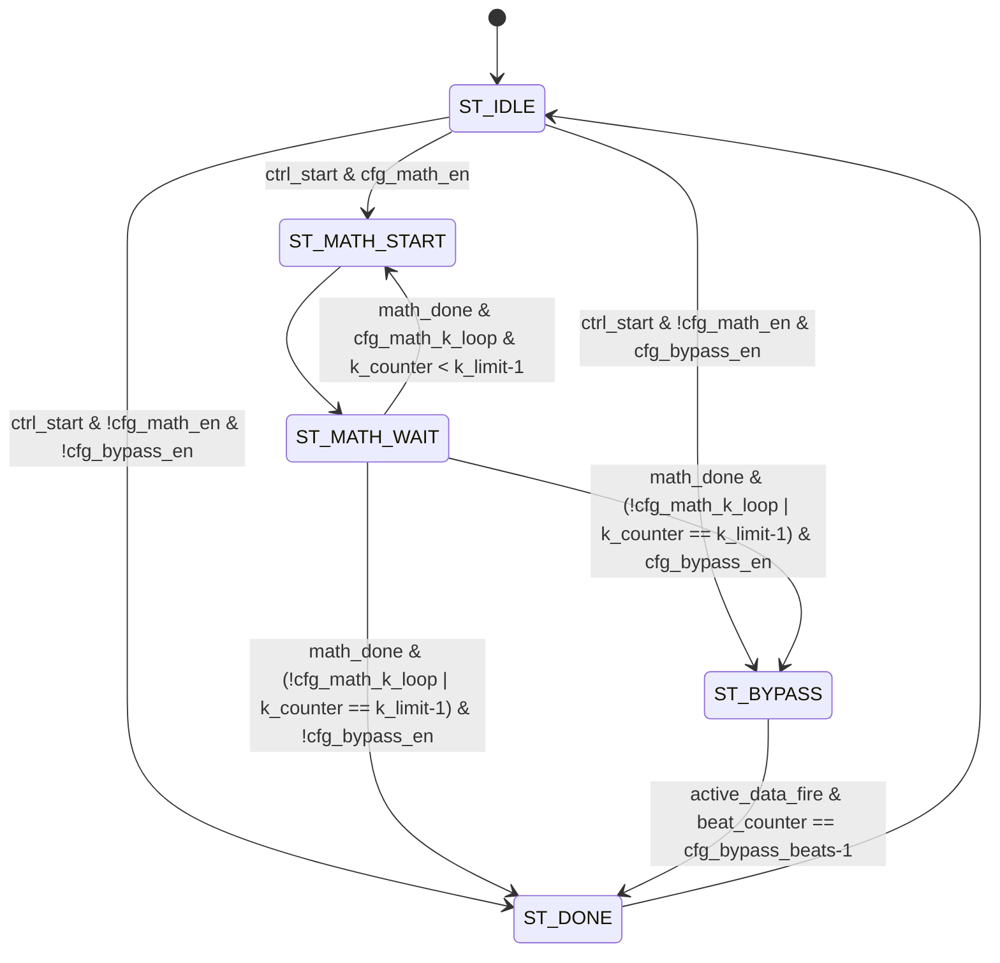
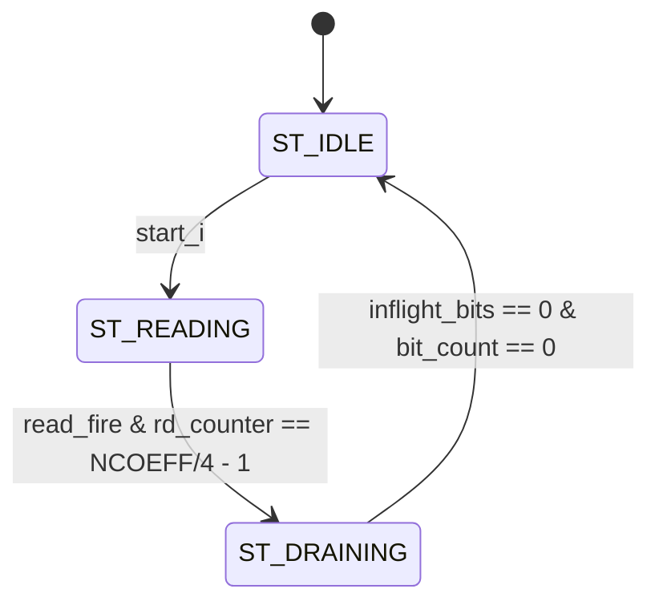
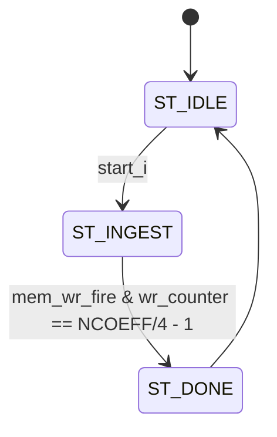

# Transcoder Unit — FSM States

## Part 1: `tr_fsm` — Master Micro-Sequencer

### 1. Overview

`tr_fsm` is the central control FSM for the Transcoder Unit. It contains **zero datapath logic and zero hardcoded ML-KEM parameters** — all protocol-specific configuration is sourced from the combinational `tr_microcode_rom`. The FSM acts as a generic execution engine that orchestrates three execution phases: a Math Phase (drives Packer or Unpacker), a Bypass Phase (routes raw 64-bit beats between AXI and the SeedBank), and a completion pulse. It also manages a beat counter and `k`-loop counter to handle vector polynomial operations (k-loop) without the math engines needing to count iterations.

### 2. State Diagram

### 3. State Definitions

| State | Encoding | Description & Key Actions |
| :--- | :--- | :--- |
| `ST_IDLE` | `3'd0` | Default state. Awaits `ctrl_start`. On assertion, latches `ctrl_opcode_i` and `ctrl_sec_level_i` into registered copies. Resets `k_counter` and `beat_counter` to zero. Feeds the microcode ROM combinationally with the incoming (unlatched) opcode to determine next state. |
| `ST_MATH_START` | `3'd1` | One-cycle pulse state. Asserts `packer_start_o` (if `cfg_is_tx`) or `unpacker_start_o` (if not `cfg_is_tx`) for exactly one cycle. Also drives `router_sel_o` to the math crossbar mode. Unconditionally transitions to `ST_MATH_WAIT` after one cycle. |
| `ST_MATH_WAIT` | `3'd2` | Waits for the active math engine to complete. Snoops `axi_tx_vld_rdy` or `axi_rx_vld_rdy` (or internal crossbar equivalents) to track beat count. Increments `beat_counter` on each valid data fire. Increments `k_counter` on each `math_done_pulse`. If k-loop is enabled and `k_counter < cfg_k_limit - 1`, returns to `ST_MATH_START` to process the next polynomial in the vector. |
| `ST_BYPASS` | `3'd3` | Raw AXI ↔ SeedBank transfer. No math engines are active. Routes data per `cfg_router_bypass_sel`. Counts beats until `beat_counter == cfg_bypass_beats - 1`. In BYPASS_TX mode, the router is held at `TR_ROUTER_IDLE` until `seed_rvalid_i` is asserted (latency shielding). |
| `ST_DONE` | `3'd4` | One-cycle terminal state. `ctrl_done_o` is asserted (Moore output, `state == ST_DONE`). Unconditionally returns to `ST_IDLE` next cycle. |

### 4. Transition Conditions

| Current State | Condition | Next State | Notes |
| :--- | :--- | :--- | :--- |
| `ST_IDLE` | `ctrl_start & cfg_math_en` | `ST_MATH_START` | ROM outputs peeked combinationally via unlatched opcode. |
| `ST_IDLE` | `ctrl_start & !cfg_math_en & cfg_bypass_en` | `ST_BYPASS` | Bypass-only opcodes (seed transfers, raw exports). |
| `ST_IDLE` | `ctrl_start & !cfg_math_en & !cfg_bypass_en` | `ST_DONE` | NOP opcode (`TR_OP_IDLE`). |
| `ST_MATH_START` | (unconditional) | `ST_MATH_WAIT` | Always 1 cycle. Start pulse delivered, now waiting. |
| `ST_MATH_WAIT` | `math_done & cfg_math_k_loop & k_counter < cfg_k_limit-1` | `ST_MATH_START` | Next polynomial in vector. `k_counter` incremented. `beat_counter` reset. |
| `ST_MATH_WAIT` | `math_done & (loop done or no loop) & cfg_bypass_en` | `ST_BYPASS` | Math complete, bypass phase follows (e.g., seed append). |
| `ST_MATH_WAIT` | `math_done & (loop done or no loop) & !cfg_bypass_en` | `ST_DONE` | Math complete, no bypass. |
| `ST_BYPASS` | `active_data_fire & beat_counter == cfg_bypass_beats-1` | `ST_DONE` | Final beat transferred. |
| `ST_DONE` | (unconditional) | `ST_IDLE` | `ctrl_done_o` is high for this 1 cycle only. |

> [!NOTE]
> `math_done_pulse` is `packer_done_i` if `cfg_is_tx`, else `unpacker_done_i`. These are 1-cycle pulses from the respective math engines.

### 5. Control Outputs

#### 5.1 Math Engine Control

| Output | Type | Active Condition | Description |
| :--- | :--- | :--- | :--- |
| `packer_start_o` | Mealy | `ST_MATH_START & cfg_is_tx` | 1-cycle pulse to launch the Packer. |
| `unpacker_start_o` | Mealy | `ST_MATH_START & !cfg_is_tx` | 1-cycle pulse to launch the Unpacker. |
| `packer_d_param_o` | Moore | Always | Compression parameter `d`, from `cfg_d_param`. Held constant for the job. |
| `unpacker_d_param_o` | Moore | Always | Same as above for Unpacker. |
| `packer_poly_id_o` | Moore | Always | `cfg_poly_base_id + k_counter`. Advances each loop iteration. |
| `unpacker_poly_id_o` | Moore | Always | Same as above for Unpacker. |

#### 5.2 Router Control

| Output | Type | Active Condition | Description |
| :--- | :--- | :--- | :--- |
| `router_sel_o` | Moore | State-dependent | `cfg_router_math_sel` in `ST_MATH_START`/`ST_MATH_WAIT`; `cfg_router_bypass_sel` in `ST_BYPASS` (with latency shielding exception); `TR_ROUTER_IDLE` otherwise. |
| `router_tlast_o` | Mealy | `ST_BYPASS` or `ST_MATH_WAIT` | Asserted combinationally on the final expected data beat. In `ST_BYPASS`: `beat_counter == cfg_bypass_beats - 1`. In `ST_MATH_WAIT` (no bypass following): `k_counter == k_limit-1 & beat_counter == math_beats_per_poly - 1`, where `math_beats_per_poly = cfg_d_param << 2`. |

#### 5.3 SeedBank Control

| Output | Type | Active Condition | Description |
| :--- | :--- | :--- | :--- |
| `seed_req_o` | Moore | `ST_BYPASS` or (`ST_MATH_WAIT & cfg_internal_math_en`) | Asserts to the SeedBank when data transfers involve it directly. |
| `seed_we_o` | Mealy | AXI-RX bypass fire or Packer→SeedBank internal fire | High when writing: `(ST_BYPASS & BYPASS_RX & axi_rx_vld_rdy) | (ST_MATH_WAIT & cfg_internal_math_en & cfg_is_tx & internal_tx_vld_rdy)`. |
| `seed_id_o` | Moore | Always | `cfg_seed_id` from microcode ROM. |
| `seed_idx_o` | Moore | Always | `beat_counter[clog2(SEED_BEATS)-1:0]` — the current beat index within the 256-bit seed object. |

#### 5.4 Beat Tracking & TLAST Generation

The FSM snoops four handshake signals to track data movement without burdening the math engines:

| Snoop Signal | Source | Used In |
| :--- | :--- | :--- |
| `axi_rx_vld_rdy_i` | `s_axis_tvalid & s_axis_tready` | RX bypass, RX math phases |
| `axi_tx_vld_rdy_i` | `m_axis_tvalid & m_axis_tready` | TX bypass, TX math phases |
| `internal_rx_vld_rdy_i` | `seed_rvalid_i & unpacker_tready` | SeedBank→Unpacker (EN_MSG_DEC) |
| `internal_tx_vld_rdy_i` | `packer_tvalid & seed_ready_i` | Packer→SeedBank (DC_MSG_ENC) |

`active_data_fire` selects the appropriate snoop based on state and phase, then increments `beat_counter`. `beat_counter` resets to 0 on every `ST_MATH_START` entry (new polynomial iteration).

### 6. Latency & Stall Conditions

* **Execution time per opcode**: Determined by the math engine throughput and the number of k-loop iterations. Each polynomial's math phase is `256 × d / 64 = d × 4` AXI beats. For a k-vector with d=12: `k × 4 × 12 = 48k` beats.
* **Bypass phase**: Fixed at `cfg_bypass_beats` beats (4 beats = 32 bytes for standard seeds).
* **No FSM stall input**: The FSM waits for `math_done_pulse`, which the Packer/Unpacker only asserts after all in-flight memory operations complete. Memory stalls extend the math phase duration transparently.
* **SRAM latency shielding**: In `ST_BYPASS` with `BYPASS_TX` mode, `router_sel_o` is held at `TR_ROUTER_IDLE` until `seed_rvalid_i` goes high, preventing the AXI-TX consumer from seeing a stall caused by SRAM read latency.

---

## Part 2: `tr_packer` — TX Gearbox FSM

### 1. Overview

`tr_packer` is a 3-state FSM controlling the TX math engine. It reads polynomial coefficients from memory 4 at a time, pipelines them through the 2-stage `compress` module, and accumulates the compressed d-bit values into a 128-bit shift register before emitting 64-bit AXI beats.

### 2. State Diagram

### 3. State Definitions & Transitions

| State | Encoding | Description |
| :--- | :--- | :--- |
| `ST_IDLE` | `2'b00` | Awaits `start_i`. Latches `d_param_i` and `poly_id_i`. Resets `rd_counter`, `shift_reg`, `bit_count`, `inflight_bits`. |
| `ST_READING` | `2'b01` | Issues PolyMem reads (4 coefficients per cycle). Stalls memory reads (`stall_read`) if `bit_count + inflight_bits + bits_per_cycle > 128` to prevent shift register overflow. Transitions to `ST_DRAINING` after the 64th read fires (`rd_counter == 63`). |
| `ST_DRAINING` | `2'b10` | No new memory reads. Waits for all in-flight compress pipeline results to land in `shift_reg` and for all buffered 64-bit beats to drain out the AXI-TX port. Done when both `inflight_bits == 0` and `bit_count == 0`. Asserts `done_o` for 1 cycle on transition to `ST_IDLE`. |

### 4. Key Internal Signals

| Signal | Description |
| :--- | :--- |
| `rd_counter [5:0]` | Read address counter (0–63). Each increment reads 4 more coefficients (indices `{rd_counter, 2'bXX}`). |
| `bit_count [7:0]` | Current number of valid bits held in `shift_reg`. `m_tvalid_o` asserted when `bit_count >= 64`. |
| `inflight_bits [7:0]` | Bits requested from memory but not yet returned. Tracks the compress pipeline occupancy. Prevents shift register overflow during backpressure. |
| `stall_read` | `(bit_count + inflight_bits + bits_per_cycle) > 128`. Prevents new reads when shift reg would overflow. |
| `poly_rd_valid_q` | 1-cycle registered delay of `poly_rd_valid_i`. The compress pipeline introduces 1 cycle of latency; this signal aligns the compress output with shift register push logic. |

---

## Part 3: `tr_unpacker` — RX Gearbox FSM

### 1. Overview

`tr_unpacker` is a 3-state FSM controlling the RX math engine. It absorbs 64-bit AXI beats into a 128-bit shift register, slices d-bit coefficient chunks from the LSBs combinationally, decompresses them via the purely combinational `decompress` module, and writes 4 coefficients per cycle to memory.

### 2. State Diagram

### 3. State Definitions & Transitions

| State | Encoding | Description |
| :--- | :--- | :--- |
| `ST_IDLE` | `2'b00` | Awaits `start_i`. Latches `d_param_i` and `poly_id_i`. Clears `shift_reg`, `bit_count`, `wr_counter`. |
| `ST_INGEST` | `2'b01` | Simultaneously accepts incoming AXI beats (push into shift reg) and writes decompressed coefficients to memory (pop from shift reg). AXI `tready` is asserted when `bit_count <= 64` (at least 64 bits of headroom). Memory writes fire when `bit_count >= bits_per_cycle` and memory is not stalled. Both can fire in the same cycle (simultaneous push and pop). Transitions when the 64th write fires (`wr_counter == 63`). |
| `ST_DONE` | `2'b10` | 1-cycle state. Asserts `done_o`. Returns unconditionally to `ST_IDLE`. |

### 4. Key Internal Signals

| Signal | Description |
| :--- | :--- |
| `wr_counter [5:0]` | Write address counter (0–63). Increments on each successful memory write fire. |
| `bit_count [7:0]` | Current valid bits in `shift_reg`. AXI `tready` gated by `bit_count <= 64`. |
| `s_tready_o` | `(bit_count <= 64) & (state == ST_INGEST)`. Dropped when buffer is more than half full to prevent overflow. |
| `mem_wr_fire` | `(bits_per_cycle > 0) & (bit_count >= bits_per_cycle) & !poly_stall_i & (state == ST_INGEST)`. All conditions must be simultaneously true for a write to occur. |
| `axi_rx_fire` | `s_tvalid_i & s_tready_o`. A 64-bit beat is accepted from the router. |
| `next_shift_reg` | Combinational: pop (`>> bits_per_cycle`) then push (`| s_tdata << next_bit_count`). Both operations may occur in the same cycle without ordering hazards. |
